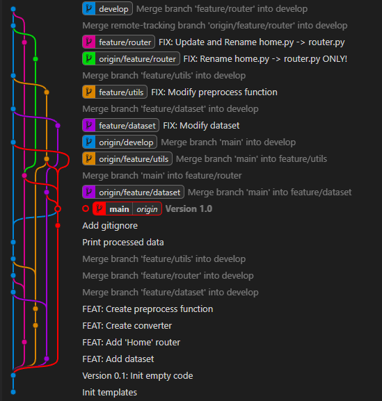

# Git 연습을 위한 Repository


## 설명
```main.py```를 실행할 시 Dataset을 불러들인다.  
불러들인 Dataset의 정보를 출력하고, Preprocess 과정을 거친다.  
Preprocess된 데이터에 대해 출력한다.  

## Default Settings
### Branch
Gitflow 형식
- **main**: 최상단 main 브랜치
- **develop**: main에 병합 전 개발 검수
- **feature/dataset**: dataset 폴더 내부 기능 구현
- **feature/router**: Main의 Router 정보를 출력하는 기능 구현
- **feature/utils**: 데이터 전처리와 같은 다양한 함수 기능 구현

## Mission

1. Dataset 권한 변경 - feature/dataset
   1. ```dataset/dataloader.py``` 내부의 Dataset 클래스 수정
   2. Dataset의 df 변수는 팀원에 대한 정보를 제공
   3. 팀원에 대한 이름, 나이, 권한 등의 정보를 자유자재로 변경
   4. develop 브랜치에 Merge

2. Preprocess 수정 - feature/utils
   1. 기존 기능에서는 Dataset에서 인원 별 이름에 대한 공백을 '@'로 처리
   2. 이름에 대한 공백을 제거
   3. develop 브랜치에 Merge
 
3. 충돌 발생 - feature/router
   1. router 폴더 내부 ```home.py```를 ```router.py```로 rename 할 예정
   2. router.py 내부에서 dataset의 라우터를 설정 예정
   3. 충돌을 유도하기 위해 2명이 Git을 현재 브랜치에서 동시에 이용한다고 있다고 가정
      1. User A - Git homepage에서 직접 push
         1. 본 Repository 홈페이지에서 feature/router 브랜치 체크아웃
         2. ```router/home.py``` 수정
         3. ```home.py```의 내용을 변경하지 않고, 이름만 ```router.py```로 수정한 후 수정
      2. User B - 로컬 Repository에서 **Fetch나 Pull 하지 않고** 진행
         1. feature/router 체크아웃
         2. ```home.py```를 ```router.py```로 변경
         3. 내용을 아래 코드로 변경(확장)
            ```python
            def set_home():
                print("The node here is 'home'!")

            def set_dataset():
                print("The node here is 'dataset'!")
            ```
         4. Push하지 않고 **Commit만 진행**
   4. Fetch 진행
   5. User A와 User B의 브랜치를 각각 Develop로 Merge
   6. User B의 커밋 내용을 Develop의 최종 Merge 내용으로 선정

   *※ 최종적으로 다음과 같은 그래프 형태로 구성*




4. Main Publish - main
   1. develop 브랜치를 main 브랜치로 최종 merge